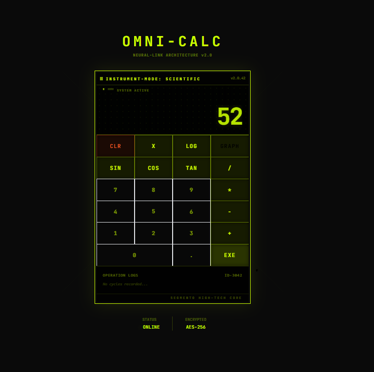

# 🛸 Omni-Calc v2.1

**Omni-Calc** is a high-performance, scientific web calculator designed with a "Futuristic Technical" aesthetic. It moves away from generic UI clichés, embracing a brutalist, industrial-glass interface inspired by high-tech laboratory instrumentation and oscilloscopes.



---

## 💎 Design Philosophy

This project strictly adheres to a set of unique design constraints:

*   **#PurpleBan**: Zero usage of purple or violet hues. The palette is built on high-contrast monochromatic scales with tactical accents like **Cyber Lime** (#ccff00) and **Emergency Orange** (#ff5722).
*   **#SharpGeometry**: No rounded "pill" shapes or soft corners. Every element uses **0px border-radius** or chamfered edges for a raw, industrial feel.
*   **#AntiSafeHarbor**: Avoids soft shadows and generic layouts. The interface uses **1px razor-thin borders**, grid overlays, and scanline effects to simulate a physical instrument.

---

## 🚀 Key Features

### 1. Scientific Engine
Powered by `math.js`, Omni-Calc handles everything from basic arithmetic to complex operations:
- `sin`, `cos`, `tan`
- `log`, `sqrt`
- Power functions (`x^y`)

### 2. Graphing Viewport (Option B)
A dedicated Canvas-based oscilloscope view for real-time function plotting.
- **Dynamic Axis**: 1px sharp grid system.
- **Tactical Tooltip**: Hover to see precise X/Y coordinates.
- **Toggle Mode**: Easily switch between standard results and graphical data.

### 3. Tactile Feedback & Motion
- **Instrument Haptics**: Buttons feature a "tactile depression" animation via Framer Motion.
- **Glitch-Fade Effects**: Display updates use high-speed transitions to mimic digital data streams.

---

## 🛠️ Tech Stack

- **Framework**: [Next.js 14 (App Router)](https://nextjs.org/)
- **Styling**: [Tailwind CSS](https://tailwindcss.com/)
- **Animation**: [Framer Motion](https://www.framer.com/motion/)
- **Math Engine**: [math.js](https://mathjs.org/)
- **Icons**: [Lucide React](https://lucide.dev/)
- **Typography**: [JetBrains Mono](https://www.jetbrains.com/lp/mono/)

---

## 📦 Installation & Setup

1. **Clone the repository**:
   ```bash
   git clone <your-repo-url>
   cd berkay
   ```

2. **Install dependencies**:
   ```bash
   npm install
   ```

3. **Run the development server**:
   ```bash
   npm run dev
   ```

4. **Open the app**:
   Navigate to [http://localhost:3000](http://localhost:3000)

---

## 📸 Screenshots

### Calculator Interface


### Graphing Mode in Action


---

## 📜 License

MIT License. Built for the future of digital instrumentation.
